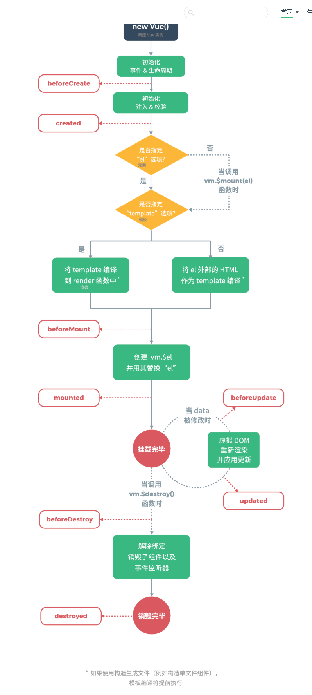

#### 基础知识
> 基本语法

    var app = new Vue({
        el: "#app",
        data: {
            seen: false,
            todos: [
                {text: "学习Vue"},
                {text: "学习Go"},
                {text: "学习Swoole"},
            ],
            messsage: "Hello, Programer!",
        },
        methods: {
            reverseMessage: function(){
                this.message = this.message.split("").reverse().join("")
            }
        }
    })
    
    1. v-bind: title = "message"        # 属性值绑定
    2. v-on: click="reverseMessage"     # 绑定方法
    3. v-for="todo in todos"    {{todo.text}}   # 遍历
    4. v-if="seen"                      # 条件控制
    5. v-model="message"                # 表单双向绑定 
    6. v-html="html"                    # 输出原生html
    7. v-bind:[dynamic_key]="url"       # dynamic_key 是一个变量
    8. 缩写
        v-bind:href => :href
        v-bind:[dynamic_key] => :[dynamic_key]

        v-on:click => @click
        v-on:[dynamic_key] => @[event]    
> 组件化应用构建
    
    1. 定义： 
        Vue.component('todo-item', {
            //todo-item 组件现在接受一个 "prop", 类似于一个自定义的 attribute
            // 这个prop名字为 todo
            props: ["todo"],
            template: '<li>{{todo.text}}</li>'  
        })
        
        var app7 = new Vue({
            el: '#app7',
            data: {
                groceryList: [
                    {id: 0, text: '蔬菜'},
                    {id: 1, text: '奶酪'},
                    {id: 2, text: 'whatever'},
                ]
            }
        });
        
        

            <ol>
                <todo-item
                    v-for="item in groceryList"
                    v-bind:todo="item"  #todo变量绑定item
                    v-bind:key="item.id"
                >
                </todo-item>
            </ol>
        

        
    2. 组件的理解
        

            <app-nav></app-nav>
            <app-view>
                <app-sidebar></app-sidebar>
                <app-content></app-content>
            </app-view>
        
    
          
          
> 语法知识

    var data = {a: 1};
    var vw= new Vue({data: data}) 
    
    1. Vue实例的data属性可以执行通过 vw.属性名 访问, vw.a => 1
    2. vw.$data === data 
       vw.$el
       vm.$watch('a',function(newValue, oldValue){
            //'vm.a'值改变后会被调用
       })         
    3. vm.a修改时，会自动更新。vm.b修改，不会更新绑定的数据（初始化时没有值）
        Object.freeze(data)后，则修改vm.a后，不会响应式更新数据
    4. 不要在选项属性或者回调上使用 箭头函数，因为这货没有 this，会作为变量一直向上找，经常导致异常。
    5. 支持简单的javascript表达式，**仅支持单个表达式** 如 {{ ok ? "Yes" : "No" }}, 不支持 {{ if (ok) {return message;}  }}
    6. 动态键名
    7. 键名不要用大写
    8. 计算属性和侦听器
        computed：计算属性 
            计算属性会缓存计算结构，适用于复杂计算的
            方法适用于不依赖与动态属性的，需要实时计算的
            computed: {
                reverseMessage: function(){
                    return this.message.split("").reverse().join("");   //会缓存结果，当依赖的message值不发生变化时，返回的结果是缓存的结果
                }
            }
            
            methods: {
                now: function(){
                    return Date.now();  //如果写在computed中，因为这货不依赖变量，所以返回的结果一直不变
                }
            }
            
            设置setter
            computed: {
                fullName: {
                    //getter
                    get: function(){
                        return this.firstName + ' ' + this.lastName;
                    },
                    //setter
                    set: function(newValue) {
                        var names = newValue.split(' ');
                        this.firstName = names[0];
                        this.lastName = names[names.length - 1]
                    }
                }
            }
        
        watch: 侦听器
            当数据变化时，需要执行异步或者较大开销时，这个方式比较有用。
            watch: {
                firstName: function(val){
                    return val + ' ' + this.lastName;
                },
                lastName: function(val) {
                    return this.firstName + ' ' + val; 
                }
            }
            
> class与style绑定
   
    var classObject = {
        active: true,
        'text-danger': false
    }
    
    # 对象语法
    v-bind:class="{'active': isActive}"    
    v-bind:class="{'active': isActive, 'text-danger': hasError}"    
    v-bind:class="{classObject}"    
    
    # 数组语法
    v-bind:class="[errorClass, activeClass]"
    v-bind:class="[errorClass, isActive ? activeClass : '']"
    
    # style
    v-bind:style="{ color: activeColor, fontSize: fontSize + 'px' }"
    
> 生命周期

          